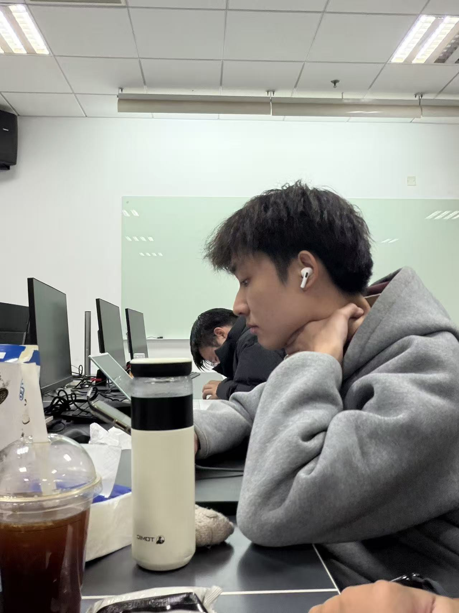
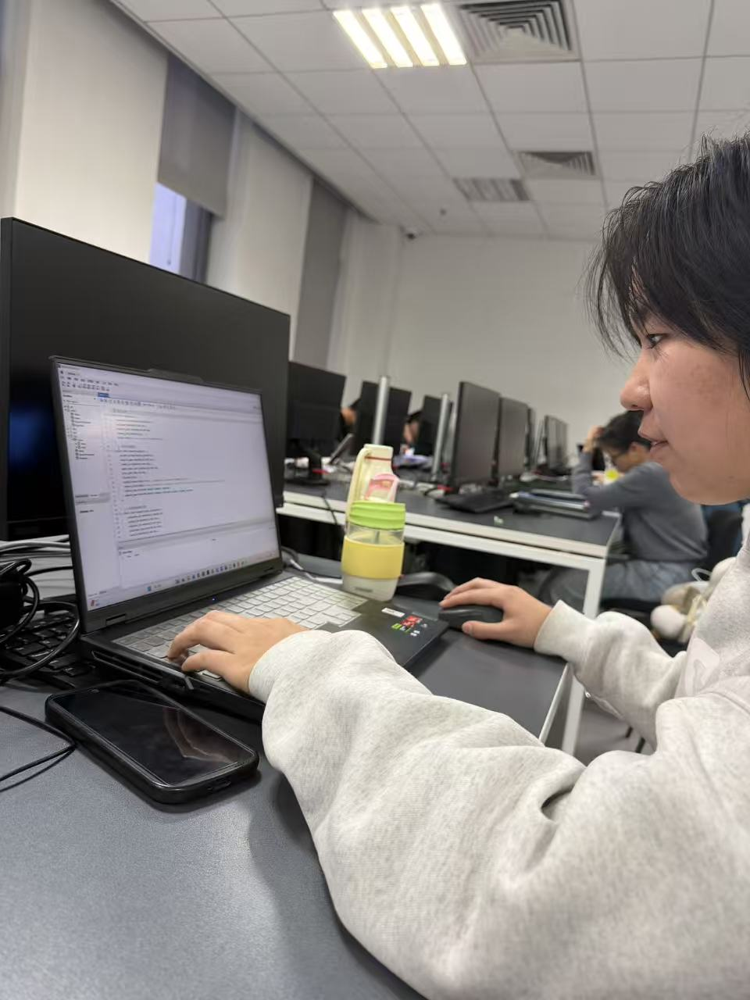

- 11.27 マンバメンタリティ第二次会议
- 会议时间:   11.30 13:30~16:55
- 会议地点:   计算中心 N03
- 记录人:   高范铖
- 会议主要内容:
- ① 高范铖 和 卢欣怡 针对第一版的全局 E-R 图进行美化排版；
- ② 刘凯文 研究并成功实现 MySQL 内数据库的多人实时共享；
- ③ 组内成员按照第一版的全局 E-R 图进行各自部分的关系模式书写；
- ④ 组内成员按照第一版的全局 E-R 图进行各自部分使用 MySQL 进行对应部分的 DDL 语句创建工作，对于一些数据讨论后决定采用统一数据类型；
- ⑤ 小组成员讨论发现 全局 E-R 图 合并存在问题，重新进行 全局 E-R 图 搭建；
- ⑥ 组内成员一致统一进行聚餐，会议结束后进行第一次小组团建；
- 会议照片: 
- 

- 

- 